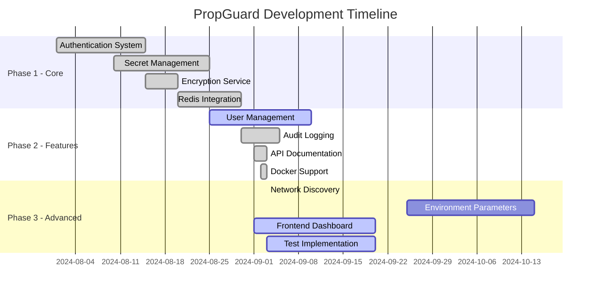

# PropGuard Service - Decision Center

> **🔒 SEALED DOCUMENTATION**: This README is currently SEALED for stability. All major architectural decisions have been finalized. Contact project maintainer before making changes.

> **📋 CENTRAL DECISION HUB**: This README serves as the single source of truth for all project decisions, architecture choices, and development direction.

A secure secrets management and configuration service built with Go, providing enterprise-grade security for sensitive data management, environment parameter control, and network discovery capabilities.

## 🎯 Decision Making Framework

### Decision Categories
- **🏗️ Architecture**: Technology choices, system design patterns
- **🔒 Security**: Security policies, encryption standards
- **🚀 Features**: New capabilities, API changes
- **⚡ Performance**: Optimization strategies, scaling decisions
- **🛠️ Tooling**: Development tools, CI/CD pipeline
- **📦 Dependencies**: Third-party libraries, external services

### Decision Process
1. **Proposal**: Document the decision needed in this README
2. **Discussion**: Add pros/cons, alternatives considered
3. **Decision**: Mark the chosen option and rationale
4. **Implementation**: Track progress in TODO list
5. **Review**: Document outcomes and lessons learned

## 🚀 Features

### Core Capabilities
- **🔐 Secure Secret Storage**: AES-256-GCM encryption for all secrets with master key protection
- **🔑 JWT Authentication**: Stateless authentication with role-based access control (RBAC)
- **💾 Redis Backend**: High-performance in-memory data structure store with optional persistence
- **📝 Comprehensive Audit Logging**: Complete audit trail for all operations with configurable retention
- **🌐 RESTful API**: Clean REST API with Swagger/OpenAPI documentation
- **🐳 Docker Ready**: Multi-container deployment with Docker Compose
- **🔍 Network Discovery**: Automated network service discovery and configuration extraction
- **⚙️ Environment Parameters**: Centralized environment configuration management with policy enforcement
- **👥 User Management**: Multi-user support with role-based permissions

### Security Features
- **Encryption at Rest**: All secrets encrypted using AES-256-GCM
- **JWT Token Authentication**: Secure, stateless authentication
- **Role-Based Access Control**: Fine-grained permission management
- **Audit Trail**: Complete operation logging with tamper protection
- **Secret Rotation History**: Track and manage secret version history
- **Policy Enforcement**: Define and enforce secret/parameter policies

## 📋 Prerequisites

- Go 1.23+ 
- Redis 7.0+ (or use Docker)
- Docker & Docker Compose (for containerized deployment)
- Make (optional, for using Makefile commands)

## 🛠️ Installation

### Quick Start with Docker

1. **Clone the repository**
   ```bash
   git clone <repository-url>
   cd prop-guard-service
   ```

2. **Configure environment**
   ```bash
   cp .env.example .env
   # Edit .env with your configuration
   ```

3. **Deploy with Docker Compose**
   ```bash
   make deploy
   # OR
   docker-compose up --build
   ```

The services will be available at:
- **Backend API**: `http://localhost:8080`
- **Swagger Docs**: `http://localhost:8080/swagger/index.html` 
- **Frontend Dashboard**: `http://localhost:3000` (Next.js + React + DaisyUI)
- **Redis**: `localhost:6379`

### Local Development Setup

1. **Install dependencies**
   ```bash
   make deps
   # OR
   go mod download
   ```

2. **Start Redis locally**
   ```bash
   docker run -d -p 6379:6379 redis:7-alpine
   ```

3. **Run the application**
   ```bash
   make run
   # OR for development mode with debug logging
   make dev-local
   ```

### Frontend Development

The React dashboard uses Next.js 15 with modern tooling:

1. **Navigate to frontend directory**
   ```bash
   cd ui/dashboard
   ```

2. **Install frontend dependencies**
   ```bash
   npm install
   ```

3. **Run frontend development server**
   ```bash
   npm run dev          # Development with Turbopack
   npm run build        # Production build
   npm run start        # Production server
   npm run lint         # ESLint checking
   ```

**Frontend Stack**:
- **Next.js 15.5.2** - React framework with App Router
- **React 19.1.0** - Latest React with concurrent features  
- **DaisyUI 5.0.54** - Component library with themes
- **TailwindCSS 4** - Utility-first CSS framework
- **TypeScript 5** - Type safety and IntelliSense
- **Lucide React** - Modern icon library

## ⚙️ Configuration

### Environment Variables

| Variable | Description | Default | Required |
|----------|-------------|---------|----------|
| **Server Configuration** |
| `SERVER_PORT` | HTTP server port | `8080` | No |
| `SERVER_READ_TIMEOUT` | HTTP read timeout | `15s` | No |
| `SERVER_WRITE_TIMEOUT` | HTTP write timeout | `15s` | No |
| `SERVER_IDLE_TIMEOUT` | HTTP idle timeout | `60s` | No |
| `GIN_MODE` | Gin framework mode (debug/release/test) | `release` | No |
| **Redis Configuration** |
| `REDIS_HOST` | Redis server hostname | `localhost` | Yes |
| `REDIS_PORT` | Redis server port | `6379` | No |
| `REDIS_PASSWORD` | Redis password | `""` | No |
| `REDIS_DATABASE` | Redis database number | `0` | No |
| `REDIS_MAX_RETRIES` | Maximum connection retry attempts | `3` | No |
| `REDIS_POOL_SIZE` | Connection pool size | `10` | No |
| `REDIS_TLS_ENABLED` | Enable TLS for Redis | `false` | No |
| `REDIS_CLUSTER_ENABLED` | Enable Redis cluster mode | `false` | No |
| **Security Configuration** |
| `JWT_SECRET` | JWT signing secret key | - | Yes |
| `JWT_EXPIRY_HOURS` | JWT token expiry in hours | `24` | No |
| `VAULT_MASTER_KEY` | Master encryption key (32 bytes) | - | Yes |
| **Audit Configuration** |
| `AUDIT_RETENTION_DAYS` | Audit log retention period | `90` | No |
| **CORS Configuration** |
| `CORS_ALLOWED_ORIGINS` | Comma-separated allowed origins | `http://localhost:3000,http://localhost:8080` | No |

### Redis Persistence Configuration

The service supports Redis persistence through both RDB and AOF:

```conf
# redis-persistence.conf
save 900 1      # Save after 900 sec if at least 1 key changed
save 300 10     # Save after 300 sec if at least 10 keys changed  
save 60 10000   # Save after 60 sec if at least 10000 keys changed
appendonly yes  # Enable AOF persistence
```

## 📋 Quick Decision Checklist

Before making any project change, ensure:

- [ ] **Decision documented in README** - Is the decision and rationale recorded in ADR section?
- [ ] **Impact assessed** - Have you filled out the change impact assessment?
- [ ] **Stakeholders notified** - Are relevant team members aware of the change?
- [ ] **Security reviewed** - If high/medium security impact, has security team reviewed?
- [ ] **Implementation planned** - Are TODO items created and timeline established?
- [ ] **Rollback plan** - How will you revert if something goes wrong?
- [ ] **Success criteria defined** - How will you measure if the change was successful?

### How to Use This README for Decision Making

1. **📋 Start Here**: Read current pending decisions in [Decision Status Dashboard](#-urgent-decisions-needed)
2. **🔍 Research**: Review existing ADRs for similar decisions and precedents
3. **📝 Document**: Add new proposal using the [ADR template](#new-decision-template)
4. **💬 Discuss**: Share with team, gather input for 48+ hours
5. **✅ Decide**: Update status and rationale, create implementation todos
6. **🚀 Execute**: Track progress in TODO list and project dashboard
7. **🔄 Review**: Update lessons learned and process improvements

## 📚 API Documentation

### Authentication Endpoints

#### Login
```bash
POST /api/v1/auth/login
Content-Type: application/json

{
  "username": "admin",
  "password": "admin123"
}
```

#### Refresh Token
```bash
POST /api/v1/auth/refresh
Authorization: Bearer <token>
```

#### Logout
```bash
POST /api/v1/auth/logout
Authorization: Bearer <token>
```

### Secret Management Endpoints

All secret endpoints require authentication via JWT token in the Authorization header.

#### Create Secret
```bash
POST /api/v1/secrets/{path}
Authorization: Bearer <token>
Content-Type: application/json

{
  "data": {
    "api_key": "secret-value",
    "password": "another-secret"
  },
  "metadata": {
    "description": "Production API credentials",
    "ttl": 3600
  }
}
```

#### Get Secret
```bash
GET /api/v1/secrets/{path}
Authorization: Bearer <token>
```

#### Update Secret
```bash
PUT /api/v1/secrets/{path}
Authorization: Bearer <token>
Content-Type: application/json

{
  "data": {
    "api_key": "new-secret-value"
  }
}
```

#### Delete Secret
```bash
DELETE /api/v1/secrets/{path}
Authorization: Bearer <token>
```

#### List Secrets
```bash
GET /api/v1/secrets?limit=20&offset=0
Authorization: Bearer <token>
```

### User Management Endpoints

#### Create User
```bash
POST /api/v1/users
Authorization: Bearer <token>
Content-Type: application/json

{
  "username": "newuser",
  "password": "securePassword123",
  "email": "user@example.com",
  "roles": ["read", "write"]
}
```

#### List Users
```bash
GET /api/v1/users
Authorization: Bearer <token>
```

#### Update User
```bash
PUT /api/v1/users/{id}
Authorization: Bearer <token>
```

#### Delete User
```bash
DELETE /api/v1/users/{id}
Authorization: Bearer <token>
```

### Environment Parameters (Coming Soon)

The service includes support for centralized environment parameter management with policy enforcement. This feature allows:
- Centralized configuration management
- Policy-based parameter validation
- Environment-specific parameter sets
- Parameter change tracking

### Network Discovery (Coming Soon)

Network discovery capabilities for automated service detection and configuration extraction:
- Service discovery across network segments
- Automatic configuration extraction
- Security credential detection
- Service dependency mapping

## 🏗️ Architecture

```
prop-guard-service/
├── cmd/
│   ├── server/          # Main application entry point
│   └── build-deploy/    # Build and deployment automation
├── internal/
│   ├── config/          # Configuration management
│   ├── controller/      # HTTP request handlers
│   │   ├── auth_controller.go
│   │   ├── secret_controller.go
│   │   ├── user_controller.go
│   │   └── network_discovery_controller.go
│   ├── dto/             # Data transfer objects
│   ├── entity/          # Domain models
│   ├── repository/      # Data access layer (Redis)
│   ├── security/        # JWT middleware & authentication
│   ├── service/         # Business logic layer
│   └── utils/           # Utility functions
├── ui/
│   └── dashboard/       # Next.js 15 + React 19 + DaisyUI dashboard
├── docs/                # Swagger documentation
├── bin/                 # Compiled binaries
├── Dockerfile           # Multi-stage Docker build
├── docker-compose.yml   # Multi-service orchestration
└── Makefile            # Build automation
```

### Service Layer Architecture

- **AuthService**: Handles authentication, JWT token generation and validation
- **SecretService**: Manages secret encryption, storage, and retrieval
- **UserService**: User management and role-based access control
- **EncryptionService**: AES-256-GCM encryption/decryption operations
- **AuditService**: Audit logging and compliance tracking
- **NetworkDiscoveryService**: Network scanning and service discovery
- **ConfigExtractionService**: Configuration parameter extraction

## 🚀 Development

### Build Commands

```bash
# Build binary
make build

# Run tests
make test

# Run with hot reload
make dev

# Generate Swagger docs
make swagger

# Format code
make fmt

# Run linter
make lint

# Clean build artifacts
make clean
```

### Docker Commands

```bash
# Build and deploy all services
make deploy

# Quick deploy without swagger generation
make quick

# Stop all services
make stop

# View logs
make logs

# Clean Docker resources
make clean-docker
```

### Testing

Run the test suite:
```bash
make test

# With coverage
make test-coverage
```

## 🚢 Production Deployment

### Security Considerations

1. **Generate secure secrets**
   ```bash
   # Generate JWT secret
   openssl rand -base64 32
   
   # Generate master encryption key (must be 32 bytes)
   openssl rand -base64 32
   ```

2. **Configure production environment**
   ```bash
   export JWT_SECRET="your-secure-jwt-secret"
   export VAULT_MASTER_KEY="your-32-byte-master-key"
   export REDIS_PASSWORD="strong-redis-password"
   export GIN_MODE="release"
   ```

3. **Enable Redis persistence**
   - Configure RDB snapshots for point-in-time recovery
   - Enable AOF for durability
   - Set up regular backups

4. **Network Security**
   - Use TLS for Redis connections in production
   - Configure firewall rules to restrict access
   - Enable CORS only for trusted origins

### Kubernetes Deployment

For Kubernetes deployment, use the following example configuration:

```yaml
apiVersion: apps/v1
kind: Deployment
metadata:
  name: propguard
spec:
  replicas: 3
  selector:
    matchLabels:
      app: propguard
  template:
    metadata:
      labels:
        app: propguard
    spec:
      containers:
      - name: propguard
        image: propguard:latest
        ports:
        - containerPort: 8080
        env:
        - name: REDIS_HOST
          value: redis-service
        - name: JWT_SECRET
          valueFrom:
            secretKeyRef:
              name: propguard-secrets
              key: jwt-secret
        - name: VAULT_MASTER_KEY
          valueFrom:
            secretKeyRef:
              name: propguard-secrets
              key: master-key
```

### High Availability Setup

For HA deployment:
1. Use Redis Cluster or Redis Sentinel for redundancy
2. Deploy multiple PropGuard instances behind a load balancer
3. Configure session affinity if needed
4. Set up monitoring and alerting

## 📊 Monitoring & Observability

### Health Check Endpoint

The `/health` endpoint provides comprehensive system status including Redis monitoring:

```bash
GET /health

Response:
{
  "status": "healthy",
  "time": 1234567890,
  "environment": "release",
  "docker": true,
  "redis": "healthy",
  "redis_host": "localhost",
  "service": "PropGuard API",
  "version": "1.0"
}
```

### Redis Monitoring

#### Built-in Redis Health Checks

PropGuard includes comprehensive Redis monitoring capabilities:

```go
// Automatic Redis health monitoring includes:
- Connection status (ping test)
- Database size tracking  
- Memory usage information
- Last save timestamp
- Connection pool metrics
```

#### Redis Metrics Available

| Metric | Description | Critical Threshold |
|--------|-------------|-------------------|
| **Connection Status** | Redis ping response | Any failure = critical |
| **Database Size** | Number of keys stored | Monitor growth trends |
| **Memory Usage** | Redis memory consumption | >80% of max memory |
| **Last Save Time** | RDB snapshot timestamp | >24 hours = warning |
| **Connection Pool** | Active/idle connections | Pool exhaustion |
| **Query Response Time** | Redis operation latency | >10ms = warning |

#### Redis Monitoring Commands

```bash
# Check Redis status via health endpoint
curl http://localhost:8080/health | jq '.redis'

# Direct Redis monitoring (if Redis CLI available)
redis-cli ping                    # Basic connectivity
redis-cli info memory           # Memory usage
redis-cli info stats            # Operation statistics  
redis-cli info replication     # Replication status
redis-cli dbsize               # Number of keys
redis-cli lastsave             # Last RDB save
```

#### Redis Configuration Monitoring

Monitor these Redis configuration settings:

```bash
# Critical settings to monitor
maxmemory-policy: allkeys-lru    # Memory eviction policy
save: 900 1 300 10 60 10000     # RDB save points
appendonly: yes                  # AOF persistence
tcp-keepalive: 300              # Connection health
timeout: 300                    # Client timeout
```

### Production Monitoring Setup

#### 1. Redis Sentinel for High Availability

```yaml
# docker-compose.yml for Redis Sentinel
redis-sentinel:
  image: redis:7-alpine
  command: redis-sentinel /etc/redis/sentinel.conf
  volumes:
    - ./redis-sentinel.conf:/etc/redis/sentinel.conf
  depends_on:
    - redis-master
    - redis-replica
```

#### 2. Redis Cluster Monitoring

For Redis cluster deployments, monitor:
- Cluster node status
- Slot distribution
- Failed nodes
- Network partitions

```bash
# Cluster health commands
redis-cli cluster nodes
redis-cli cluster info
redis-cli cluster check
```

#### 3. Alerting Thresholds

Set up alerts for:

| Alert | Condition | Severity |
|-------|-----------|----------|
| **Redis Down** | Ping fails or connection refused | Critical |
| **High Memory** | Memory usage >80% | Warning |
| **Slow Queries** | Query time >100ms | Warning |
| **Failed Save** | Last save >24 hours ago | Warning |
| **Connection Pool Full** | All connections in use | Critical |
| **High Error Rate** | >1% failed operations | Warning |

#### 4. Integration with External Monitoring

##### Prometheus Integration (Future)
```yaml
# Example metrics endpoint (planned)
GET /metrics
# Response includes:
redis_connected_clients
redis_used_memory_bytes
redis_keyspace_hits_total
redis_keyspace_misses_total
redis_commands_processed_total
```

##### Grafana Dashboard (Future)
- Redis connection status
- Memory usage over time
- Command throughput
- Error rates
- Persistence status

### Application Metrics to Monitor

#### Core Metrics
- **API Response Times**: Target <50ms average
- **Secret Access Patterns**: Monitor for unusual access
- **Authentication Failures**: Rate limit trigger detection
- **Audit Log Volume**: Ensure logging is functioning
- **JWT Token Validation**: Track failures and timing

#### Redis-Specific Application Metrics
- **Secret Retrieval Time**: Should be <5ms
- **Secret Storage Time**: Should be <10ms
- **User Session Lookups**: Track Redis hit/miss ratio
- **Audit Log Writes**: Monitor Redis write performance

### Troubleshooting Guide

#### Common Redis Issues

1. **High Memory Usage**
   ```bash
   # Check memory breakdown
   redis-cli info memory
   # Check largest keys
   redis-cli --bigkeys
   ```

2. **Slow Performance**
   ```bash
   # Monitor slow queries
   redis-cli config set slowlog-log-slower-than 10000
   redis-cli slowlog get 10
   ```

3. **Connection Issues**
   ```bash
   # Check connection limits
   redis-cli info clients
   # Check network connectivity
   redis-cli ping
   ```

4. **Persistence Problems**
   ```bash
   # Check last save status
   redis-cli lastsave
   # Force manual save
   redis-cli bgsave
   ```

## 🤝 Contributing

1. Fork the repository
2. Create a feature branch (`git checkout -b feature/amazing-feature`)
3. Commit your changes (`git commit -m 'Add amazing feature'`)
4. Push to the branch (`git push origin feature/amazing-feature`)
5. Open a Pull Request

### Development Guidelines

- Follow Go best practices and idioms
- Write unit tests for new functionality
- Update API documentation for endpoint changes
- Ensure all tests pass before submitting PR
- Add appropriate audit logging for security-relevant operations

## 📄 License

This project is licensed under the Apache 2.0 License - see the [LICENSE](LICENSE) file for details.

## 🆘 Support

For issues, questions, or contributions, please:
- Open an issue on GitHub
- Contact the maintainers at support@propguard.io
- Check the [API Documentation](http://localhost:8080/swagger/index.html)

## 📋 Architecture Decision Records (ADR)

### ADR-001: Database Technology Selection
**Date**: 2024-08-15  
**Status**: ✅ Decided  
**Decision**: Use Redis as primary data store

**Context**: Need persistent storage for secrets, user data, and audit logs
- **Option A**: Redis (In-memory with persistence) ✅ **SELECTED**
- **Option B**: PostgreSQL (Relational database)
- **Option C**: Other NoSQL databases

**Decision Rationale**:
- High performance for secret retrieval (sub-millisecond)
- Built-in clustering and replication
- Perfect for session management and caching
- Simpler deployment and maintenance
- Native support for key-value patterns used in secret management

**Consequences**:
- ✅ Excellent performance
- ✅ Simple data model
- ⚠️ More complex for complex queries
- ⚠️ Memory usage considerations

---

### ADR-002: Encryption Standard
**Date**: 2024-08-20  
**Status**: ✅ Decided  
**Decision**: AES-256-GCM for secret encryption

**Context**: Need strong encryption for secrets at rest
- **Option A**: AES-256-CBC
- **Option B**: AES-256-GCM ✅
- **Option C**: ChaCha20-Poly1305

**Decision Rationale**:
- Authenticated encryption (integrity + confidentiality)
- Hardware acceleration on most platforms
- Industry standard for enterprise applications
- Better performance than CBC mode

---

### ADR-003: Authentication Method
**Date**: 2024-08-10  
**Status**: ✅ Decided  
**Decision**: JWT with stateless authentication

**Context**: Need secure authentication for API access
- **Option A**: Session-based authentication
- **Option B**: JWT tokens ✅
- **Option C**: API keys only

**Decision Rationale**:
- Stateless (scalable)
- Industry standard
- Works well with microservices
- Built-in expiration handling

---

### ADR-004: Frontend Technology Stack
**Date**: 2024-09-03  
**Status**: ✅ Decided  
**Decision**: Next.js 15 + React 19 + DaisyUI + TailwindCSS + TypeScript

**Context**: Need modern, responsive admin dashboard for secret management
- **Option A**: Next.js + React + DaisyUI + TailwindCSS ✅
- **Option B**: Vue.js + Nuxt + Vuetify
- **Option C**: Server-side rendered with Go templates  
- **Option D**: CLI-only approach

**Decision Rationale**:
- **Next.js 15**: Latest stable with Turbopack for fast development
- **React 19**: Latest version with concurrent features
- **DaisyUI**: Component library built on TailwindCSS for rapid UI development
- **TailwindCSS 4**: Utility-first CSS framework for consistent design
- **TypeScript**: Type safety and better developer experience
- **Lucide React**: Modern icon library

**Technology Stack Details**:
```json
{
  "next": "15.5.2",           // React framework with SSR/SSG
  "react": "19.1.0",          // UI library
  "daisyui": "^5.0.54",      // Component library
  "tailwindcss": "^4",       // CSS framework
  "lucide-react": "^0.542.0", // Icon library
  "typescript": "^5"          // Type safety
}
```

**Consequences**:
- ✅ Modern, responsive UI with minimal custom CSS
- ✅ Type safety across frontend codebase
- ✅ Fast development with pre-built components
- ✅ Excellent performance with Next.js optimizations
- ✅ Professional UI with DaisyUI themes
- ⚠️ Larger bundle size than vanilla approaches
- ⚠️ Additional build complexity vs server-side templates

---

### ADR-005: Network Discovery Security Model
**Date**: 2024-09-03  
**Status**: ✅ Decided  
**Decision**: Remove network discovery feature entirely (Option D)

**Context**: Network discovery feature posed significant security and legal risks
- **Option A**: Sandboxed execution with limited network access
- **Option B**: Separate service with restricted permissions  
- **Option C**: Plugin architecture with security boundaries
- **Option D**: Remove network discovery feature ✅

**Security Risks Identified**:
- **Reconnaissance Appearance**: Network scanning resembles malicious reconnaissance activity
- **Unauthorized Access**: Could accidentally access systems without permission
- **Legal Liability**: May violate security policies, compliance requirements, or laws
- **Alert Triggering**: Would likely trigger security monitoring systems
- **Credential Theft**: Automated credential discovery could be seen as malicious
- **Attack Surface**: Adds unnecessary complexity and potential vulnerabilities

**Decision Rationale**:
- **Security First**: PropGuard should be a secure secrets manager, not a security risk
- **Legal Protection**: Removes potential legal and compliance issues
- **Focus**: Concentrate on core secrets management functionality
- **Simplicity**: Reduces codebase complexity and maintenance burden
- **Trust**: Users expect secrets managers to be ultra-secure, not perform network scanning

**Implementation Actions**:
- Remove network discovery service code
- Remove related controllers and endpoints
- Clean up documentation and references
- Focus development on core secrets management

**Consequences**:
- ✅ **Eliminates security risks** and legal liabilities
- ✅ **Simplifies architecture** and reduces attack surface
- ✅ **Improves trust** - users expect secrets managers to be conservative
- ✅ **Faster development** - focus on core functionality
- ⚠️ **Feature removal** - but this was never a core requirement

---

### ADR-006: Test Framework Selection
**Date**: 2024-09-03  
**Status**: ✅ Decided  
**Decision**: Go Standard Testing + Testify + Testcontainers (Option A)

**Context**: PropGuard has 0% test coverage, blocking production readiness and CI/CD pipeline
- **Option A**: Go Standard Testing + Testify + Testcontainers ✅
- **Option B**: Ginkgo + Gomega (BDD-style)
- **Option C**: GoConvey (Web UI testing)

**Testing Requirements**:
- Unit tests for all services (auth, secrets, encryption, audit)
- Integration tests for Redis operations
- API endpoint testing
- Security-focused testing (encryption, JWT, permissions)
- Docker-based integration tests

**Decision Rationale**:
- **Go Standard Testing**: Built-in, familiar to all Go developers, zero learning curve
- **Testify**: Most popular Go assertion library, rich matchers, mocking support
- **Testcontainers**: Real Redis integration tests without external dependencies
- **Industry Standard**: Used by majority of Go projects
- **CI/CD Friendly**: Excellent tooling support, easy integration
- **Security Testing**: Perfect for secrets management testing patterns

**Technology Stack Details**:
```go
// Core testing dependencies
"testing"                    // Go standard library
"github.com/stretchr/testify" // Assertions and mocking
"github.com/testcontainers/testcontainers-go" // Integration testing
"github.com/testcontainers/testcontainers-go/modules/redis" // Redis testing
```

**Testing Structure**:
```
internal/
├── service/
│   ├── auth_service_test.go
│   ├── secret_service_test.go  
│   ├── encryption_service_test.go
│   └── audit_service_test.go
├── repository/
│   ├── redis_client_test.go
│   └── integration_test.go
└── controller/
    ├── auth_controller_test.go
    └── secret_controller_test.go
```

**Testing Standards**:
- **Unit Tests**: Test business logic in isolation
- **Integration Tests**: Test with real Redis using Testcontainers
- **Security Tests**: Verify encryption, JWT validation, permissions
- **Coverage Target**: >80% code coverage
- **Parallel Execution**: All tests must be parallelizable

**Consequences**:
- ✅ **Zero Learning Curve**: Standard Go testing, familiar to all developers
- ✅ **Excellent Tooling**: IDE support, CI/CD integration, coverage tools
- ✅ **Real Integration Tests**: Testcontainers provides real Redis instances
- ✅ **Security-Focused**: Perfect for testing encryption and auth flows
- ✅ **Fast Execution**: Parallel testing, efficient test runs
- ⚠️ **Less Fancy**: No BDD syntax or web UI (but not needed)

---

## 🏛️ Project Governance

### Decision Authority Matrix

| Decision Type | Authority | Approval Required |
|---------------|-----------|-------------------|
| **Architecture Changes** | Tech Lead + README documentation | Team review (3 days) |
| **Security Policies** | Security Officer + README update | Mandatory security review |
| **API Breaking Changes** | Product Owner + versioning plan | Stakeholder approval |
| **Dependencies** | Lead Developer + security scan | Automated security check |
| **Infrastructure** | DevOps Lead + cost analysis | Budget approval if >$100/month |

### Change Request Process

1. **📝 Document in README**: All changes start here
2. **🔍 Impact Analysis**: Assess technical, security, and business impact  
3. **💬 Team Discussion**: Minimum 48 hours for feedback
4. **✅ Approval**: Based on authority matrix above
5. **📊 Implementation Tracking**: Use TODO list and progress tracking
6. **🔄 Review**: Post-implementation review and lessons learned

### Current Pending Decisions Requiring Input

| Decision | Deadline | Priority | Status |
|----------|----------|----------|--------|
| CI/CD Pipeline Choice (ADR-007) | 2024-09-20 | Medium | Needs proposal |
| Rate Limiting Strategy (ADR-008) | 2024-09-25 | Medium | Needs proposal |
| Environment Parameters Storage (ADR-009) | 2024-09-30 | Medium | Needs proposal |
| Secret Versioning Strategy (ADR-010) | 2024-10-05 | Low | Needs proposal |

### Decision Templates

#### New Decision Template
```markdown
### ADR-XXX: [Decision Title]
**Date**: YYYY-MM-DD  
**Status**: 📝 Proposal | 🔄 Under Review | ✅ Decided | ❌ Rejected | 🔄 Superseded  
**Decision**: TBD

**Context**: [Why this decision is needed]
- **Option A**: [Description]
- **Option B**: [Description] 
- **Option C**: [Description]

**Decision Rationale**: [Why this option was chosen]

**Consequences**:
- ✅ [Positive outcomes]
- ⚠️ [Trade-offs/concerns]
- ❌ [Negative impacts]

**Implementation Status**: [Link to TODO items]
**Review Date**: [When to revisit this decision]
```

## 📊 Project Progress

### Overall Completion: ~65%

#### Core Modules Progress

| Module | Status | Progress | Description |
|--------|--------|----------|-------------|
| **Authentication System** | ✅ Complete | 100% | JWT-based auth with refresh tokens |
| **Secret Management** | ✅ Complete | 100% | Full CRUD with encryption |
| **User Management** | 🟨 In Progress | 75% | Basic CRUD done, roles pending |
| **Audit Logging** | ✅ Complete | 100% | Comprehensive audit trail |
| **Encryption Service** | ✅ Complete | 100% | AES-256-GCM implementation |
| **Redis Integration** | ✅ Complete | 100% | Full persistence layer |
| **API Documentation** | ✅ Complete | 100% | Swagger/OpenAPI specs |
| **Docker Support** | ✅ Complete | 100% | Multi-stage build & compose |
| **Network Discovery** | ❌ Removed | 0% | Removed per ADR-005 (security risks) |
| **Environment Parameters** | 🟥 Not Started | 0% | Awaiting ADR-009 decision |
| **Frontend Dashboard** | 🟨 In Progress | 40% | React app structure ready |
| **Test Coverage** | 🟨 In Progress | 15% | Testing framework set up, first tests created |

#### Development Timeline



#### Current Sprint (Week of Sep 3, 2025)

**Sprint Goal**: Complete user management and frontend integration

| Task | Assignee | Status | Priority | Est. Hours |
|------|----------|--------|----------|------------|
| Complete user roles implementation | Backend Team | 🔄 In Progress | High | 8h |
| Frontend secret management UI | Frontend Team | 🔄 In Progress | High | 12h |
| Network discovery POC | R&D Team | 📋 Planned | Medium | 16h |
| Write unit tests for services | QA Team | 📋 Planned | High | 20h |
| Redis cluster configuration | DevOps | ✅ Done | Medium | 4h |
| API rate limiting | Backend Team | 📋 Planned | Medium | 6h |

#### Recent Achievements (Last 7 Days)
- ✅ Implemented Redis persistence layer with clustering support
- ✅ Added comprehensive Swagger documentation
- ✅ Created Docker multi-stage build pipeline
- ✅ Set up audit logging with retention policies
- ✅ Implemented CORS middleware with configurable origins
- ✅ Added health check endpoint with detailed status
- ✅ **Removed network discovery security risks (ADR-005)**
- ✅ **Set up testing framework with Testify (ADR-006)**
- ✅ **Cleaned up unused dependencies**

#### Upcoming Milestones

| Milestone | Target Date | Status | Key Deliverables |
|-----------|------------|--------|------------------|
| **v0.5-alpha** | Sep 10, 2025 | 🔄 On Track | Basic secret management, auth, audit |
| **v0.7-beta** | Sep 20, 2025 | 📅 Planned | User management, frontend dashboard |
| **v0.9-rc** | Oct 1, 2025 | 📅 Planned | Network discovery, env parameters |
| **v1.0-release** | Oct 15, 2025 | 📅 Planned | Full test coverage, production ready |

#### Performance Metrics

| Metric | Current | Target | Status |
|--------|---------|--------|--------|
| API Response Time (avg) | 45ms | <50ms | ✅ Meeting |
| Concurrent Users | 100 | 500 | 🟨 Needs Work |
| Secret Encryption Time | 2ms | <5ms | ✅ Meeting |
| Memory Usage (idle) | 125MB | <200MB | ✅ Meeting |
| Redis Query Time | 1ms | <2ms | ✅ Meeting |
| Test Coverage | 0% | >80% | 🟥 Critical |

#### Risk Register

| Risk | Impact | Probability | Mitigation | Status |
|------|--------|-------------|------------|--------|
| Redis single point of failure | High | Medium | Implement Redis Sentinel | 🔄 In Progress |
| Missing test coverage | High | High | Dedicated test sprint | 📋 Planned |
| Network discovery security | High | Low | Sandbox environment | 📋 Planned |
| Frontend delays | Medium | Medium | Additional resources | 🔄 Monitoring |

## 🔄 Change Management & Decision Tracking

### Change Impact Assessment Template

Before implementing any change, assess:

| Impact Area | Questions to Ask | Risk Level |
|-------------|------------------|------------|
| **Security** | Does this change affect authentication, authorization, encryption, or audit logging? | 🔴 High Risk |
| **API Compatibility** | Will existing clients break? Are we maintaining semantic versioning? | 🟡 Medium Risk |
| **Performance** | How does this affect response times, memory usage, or scalability? | 🟡 Medium Risk |
| **Dependencies** | Are we adding new dependencies? What are their security/maintenance implications? | 🟡 Medium Risk |
| **Infrastructure** | Does this require new deployment procedures, environment variables, or resources? | 🟢 Low Risk |

### Decision Status Dashboard

#### 🚨 URGENT DECISIONS NEEDED
- **ADR-005: Network Discovery Security** (Due: Sep 10) - Security implications need resolution
- **Test Framework Selection** (Due: Sep 15) - Blocking development progress

#### 🔄 UNDER REVIEW
- **ADR-004: Frontend Technology** - React POC in progress

#### ✅ RECENTLY DECIDED (Last 30 Days)
- **ADR-003: JWT Authentication** (Aug 10) - Implementation complete
- **ADR-002: AES-256-GCM Encryption** (Aug 20) - Implementation complete
- **ADR-001: Redis Database** (Aug 15) - Implementation complete

### Implementation Tracking

Link decisions to implementation items in TODO list:

| ADR | Implementation Items | Status | Target Date |
|-----|---------------------|--------|-------------|
| ADR-004 | Complete React dashboard | 🔄 In Progress | Sep 20 |
| ADR-005 | Network discovery security | ⏸️ Blocked on decision | TBD |
| TBD | Test framework setup | ⏸️ Blocked on decision | Sep 15 |

### Decision Review Schedule

| Review Type | Frequency | Next Review | Purpose |
|-------------|-----------|-------------|---------|
| **Architecture Review** | Monthly | Oct 1, 2024 | Assess architectural decisions, technical debt |
| **Security Review** | Bi-weekly | Sep 15, 2024 | Review security decisions, vulnerability assessment |
| **Performance Review** | Monthly | Oct 1, 2024 | Evaluate performance decisions, optimization opportunities |
| **Dependency Review** | Quarterly | Dec 1, 2024 | Audit dependencies, security updates, license compliance |

### Lessons Learned

#### What Worked Well
- **Redis Decision**: Excellent performance, simplified deployment
- **JWT Authentication**: Stateless design enables horizontal scaling
- **Docker-First Approach**: Consistent development and deployment experience

#### What Could Be Improved
- **Decision Timeline**: Some decisions took too long, blocking development
- **Impact Assessment**: Need better template for assessing changes
- **Communication**: Decision rationale should be communicated to stakeholders faster

#### Action Items for Process Improvement
- [ ] Create automated decision reminder system
- [ ] Establish weekly decision review meetings
- [ ] Create decision impact calculator tool

## 📝 TODO List

### 🚨 CRITICAL - Immediate Action Required

- [x] **✅ COMPLETED: Remove Network Discovery Code** - Completed Sep 3
  - [x] Delete network discovery service files (21KB removed)
  - [x] Remove network discovery controller (17KB removed)
  - [x] Clean up imports and references
  - [x] Update documentation and feature lists
  - [x] Remove unused dependencies

- [x] **✅ COMPLETED: Set Up Testing Framework** - Completed Sep 3  
  - [x] Add testify and testcontainers dependencies to go.mod
  - [x] Create first unit test for encryption service
  - [x] Set up test coverage reporting in Makefile
  - [x] Configure testing structure and standards

### 🎯 HIGH PRIORITY - Current Sprint Focus

- [ ] **Complete User Management** - Target: Sep 10
  - [ ] Implement role-based permissions (in progress: 75%)
  - [ ] Add user role assignment endpoints
  - [ ] Test user management workflows

- [ ] **Frontend Dashboard MVP** - Target: Sep 15  
  - [ ] Complete secret management UI (40% done)
  - [ ] Implement authentication flow
  - [ ] Add basic user management interface
  - [ ] Connect to backend APIs

- [ ] **Testing Foundation** - Target: Sep 20 (blocked by ADR-006)
  - [ ] Add unit tests for authentication service
  - [ ] Add unit tests for secret service  
  - [ ] Add integration tests for API endpoints
  - [ ] Set up test coverage reporting

- [ ] **Security Hardening** - Target: Sep 25
  - [ ] Implement API rate limiting (needs ADR-008)
  - [ ] Add brute force protection for login attempts
  - [ ] Implement request timeout and size limits
  - [ ] Add security headers middleware

### 📅 MEDIUM PRIORITY - Next Sprint (Sep 25 - Oct 10)

- [ ] **Advanced Frontend Features** - Target: Oct 5
  - [ ] Add real-time audit log viewer with filtering  
  - [ ] Create advanced secret management (versioning, sharing)
  - [ ] Build comprehensive user management panel
  - [ ] Add responsive mobile interface

- [ ] **Environment Parameters Module** - Target: Oct 1
  - [ ] Design parameter storage schema in Redis
  - [ ] Implement parameter CRUD operations
  - [ ] Add policy validation engine
  - [ ] Create environment-specific parameter sets

- [ ] **API Enhancements** - Target: Oct 10
  - [ ] Add batch operations for secrets (create/update/delete multiple)
  - [ ] Implement secret versioning and rollback
  - [ ] Add secret sharing with time-based expiration
  - [ ] Create webhook notifications for events

- [ ] **CI/CD Pipeline** - Target: Oct 5 (needs ADR-007)
  - [ ] Set up GitHub Actions or GitLab CI
  - [ ] Implement automated testing pipeline
  - [ ] Add automated security scanning
  - [ ] Create deployment automation

### 📦 LOW PRIORITY - Future Releases

- [ ] **Third-party Integrations** (Version 1.1)
  - [ ] HashiCorp Vault backend support
  - [ ] Kubernetes secrets synchronization
  - [ ] AWS Secrets Manager integration  
  - [ ] Azure Key Vault integration

- [ ] **Performance Optimizations** (Version 1.2)
  - [ ] Implement Redis caching layer for frequently accessed secrets
  - [ ] Add connection pooling optimizations
  - [ ] Implement async audit logging
  - [ ] Add bulk import/export functionality

- [ ] **Advanced Documentation** (Version 1.1)
  - [ ] Create API client SDKs (Go, Python, JavaScript)
  - [ ] Add deployment guides for cloud providers (AWS, GCP, Azure)
  - [ ] Write comprehensive security best practices guide
  - [ ] Create video tutorials and demos

### ✅ COMPLETED (Last 30 Days)
- [x] Basic authentication with JWT tokens
- [x] Secret CRUD operations with encryption
- [x] AES-256-GCM encryption implementation
- [x] Redis backend integration with persistence
- [x] Docker containerization with multi-stage builds
- [x] Swagger API documentation with examples
- [x] CORS configuration with environment controls
- [x] Health check endpoint with Redis monitoring
- [x] Audit logging framework with retention
- [x] User management structure and basic CRUD
- [x] **Frontend technology stack decision (ADR-004)**
- [x] **Comprehensive README restructure as decision center**
- [x] **Redis monitoring and alerting documentation**
- [x] **Network discovery security decision and code removal (ADR-005)**
- [x] **Testing framework selection and setup (ADR-006)**
- [x] **Dependency cleanup**

## 🔄 Future Roadmap

### Version 2.0
- [ ] Multi-tenancy support with namespace isolation
- [ ] Hardware Security Module (HSM) integration
- [ ] Advanced secret rotation automation
- [ ] Kubernetes operator for automated deployment
- [ ] LDAP/Active Directory authentication
- [ ] Prometheus metrics export
- [ ] GraphQL API support

### Version 3.0
- [ ] CLI tool for secret management
- [ ] Terraform provider for infrastructure as code
- [ ] Zero-knowledge architecture
- [ ] Distributed consensus for HA
- [ ] AI-powered anomaly detection
- [ ] Blockchain audit trail option